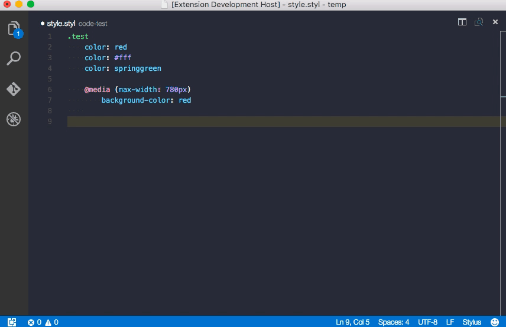

# Stylus language support for Visual Studio Code


[](https://marketplace.visualstudio.com/items?itemName=sysoev.language-stylus)
[](https://marketplace.visualstudio.com/items?itemName=sysoev.language-stylus)
[](https://marketplace.visualstudio.com/items?itemName=sysoev.language-stylus)
[](https://github.com/d4rkr00t/language-stylus/issues)
[](https://github.com/d4rkr00t/language-stylus/pulls)


Adds syntax highlighting and code completion to Stylus files in Visual Studio Code.

Syntax was stolen from here: https://github.com/matthojo/language-stylus.

### Features

* Syntax highlighting
* Symbols provider
* Completion for selectors, properties, values, variables, functions etc.
* Color preview




### Configuration
```js
{
  // Use ':' as separator between property and value
  "languageStylus.useSeparator": true, // default value
  // Toggle matches for Stylus Builtin Functions on autocomplete
  "languageStylus.useBuiltinFunctions": true, // default value
  // Toggle colors preview
  "editor.colorDecorators": true // default value
}
```

### TODO
* Tags completion
* SVG properties completion
